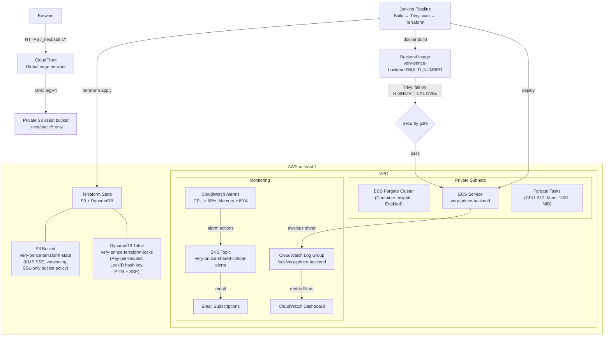

# Very-Prince Infrastructure Architecture

## Overview

This document describes the AWS infrastructure provisioned via Terraform for the very-prince backend service and its Next.js static-asset CDN. The infrastructure enables CloudWatch log aggregation, metric alarms, dashboards, SNS alert notifications for an ECS Fargate cluster, and global delivery of immutable frontend bundles.



## Terraform State Management

The very-prince Terraform state lives in Amazon S3 and is protected against
concurrent writes by a DynamoDB-backed lock table. The same root module
provisions both resources on the first bootstrap run, then subsequent plans
and applies read/write state remotely with serialized locking.

### Resources

| Resource | Type | Name | Notes |
|---|---|---|---|
| State bucket | `aws_s3_bucket` | `very-prince-terraform-state` | Versioning enabled, KMS SSE with bucket key, public access fully blocked |
| Bucket policy | `aws_s3_bucket_policy` | (attached to state bucket) | Denies any `s3:*` action when `aws:SecureTransport = false` |
| Lock table | `aws_dynamodb_table` | `very-prince-terraform-locks` | `PAY_PER_REQUEST`, `LockID` (String) hash key, PITR + SSE enabled |

### Bootstrap workflow (first-time only)

The S3 backend references resources that this same Terraform configuration
creates, so a one-time bootstrap is required before `init` can talk to S3:

1. Comment out the `backend "s3" { ... }` block in `terraform/backend.tf`.
2. From the `terraform/` directory, run:
   - `terraform init -backend=false -input=false`
   - `terraform apply -auto-approve -input=false`
3. Uncomment the backend block in `terraform/backend.tf`.
4. Run the platform-appropriate bootstrap script:
   - **Linux/macOS/WSL**: `scripts/bootstrap-terraform-backend.sh`
   - **Native Windows (PowerShell)**: `scripts/bootstrap-terraform-backend.ps1`

These scripts verify the bucket and DynamoDB table exist, then run
`terraform init -migrate-state -input=false -force-copy` followed by a
`plan`/`apply` cycle with `-lock=true -lock-timeout=300s` to prove that
DynamoDB locking is enforced on every run.

### Locking semantics

- Terraform acquires a lock on the `LockID` row in the DynamoDB table before
  any state read/write.
- Concurrent `terraform apply` invocations fail fast with a lock error
  rather than corrupting the state file.
- Jenkins passes `-lock=true` to every `plan` and `apply`, so the lock is
  always asserted during CI/CD execution.
- Lock TTL is 300 seconds; if a prior run crashed, `terraform force-unlock`
  may be used to release the lock.

### Outputs

| Output | Description |
|---|---|
| `state_bucket_arn` / `state_bucket_name` | Reference the state S3 bucket |
| `dynamodb_lock_table_name` / `dynamodb_lock_table_arn` | Reference the lock table |
| `state_backend_type` | Returns `"s3"` |
| `state_locking_enabled` | Returns `true` |

## Components

### ECS Cluster (`terraform/modules/ecs-cluster/`)
- Fargate + Fargate Spot capacity providers, configured via `aws_ecs_cluster_capacity_providers`
- Container Insights enabled for enhanced metrics
- Tagged with Project/Environment
- Strict `name` validation (non-empty, ≤255 chars, starts with a letter, alphanumeric/hyphen/underscore only)

### Fargate Task Definition (`terraform/modules/fargate-task/`)
- Strict, declarative `aws_ecs_task_definition` module used by `ecs-service`
- Enforces Fargate compatibility: `network_mode = "awsvpc"`, `requires_compatibilities = ["FARGATE"]`
- Validates CPU, memory, OS family, and CPU architecture at the variable layer
- Supports optional task role and required execution role

### ECS Service (`terraform/modules/ecs-service/`)
- Task definition with `awslogs` log driver → CloudWatch Logs
- Execution role: CloudWatch Logs write + ECR pull (via `AmazonECSTaskExecutionRolePolicy` managed policy)
- Task role: Least-privilege application permissions (empty inline policy by default; attach application-specific policies externally)
- Network: Private subnets + security group; no public IP assignment
- Optional ALB target group attachment
- Deployment circuit breaker with automatic rollback

#### IAM Roles Created by `ecs-service` Module

| Role | Name Pattern | Trust Policy | Attached Policies | Purpose |
|---|---|---|---|---|
| Execution Role | `{service-name}-execution-role` | `ecs-tasks.amazonaws.com` | `arn:aws:iam::aws:policy/service-role/AmazonECSTaskExecutionRolePolicy` | Allows ECS agent to pull container images from ECR and write task logs to CloudWatch Logs |
| Task Role | `{service-name}-task-role` | `ecs-tasks.amazonaws.com` | None (empty inline policy) | Assumed by the running application container; attach least-privilege policies for AWS API access (e.g., SSM Parameter Store, Secrets Manager) via external `aws_iam_role_policy` resources |

### Strict Module Validation

All ECS-related Terraform modules validate inputs at the variable layer to prevent invalid resource configurations:

- `ecs-cluster`: `name` must be non-empty, ≤255 characters, start with a letter, and contain only letters, digits, hyphens, and underscores.
- `fargate-task`: `cpu` and `memory` must be Fargate-supported values; `network_mode` must be `awsvpc`; `requires_compatibilities` must include `FARGATE`; `operating_system_family` and `cpu_architecture` must be ECS-supported values.
- `ecs-service`: `container_port` must be in the range 1–65535.

These validations fail `terraform plan` early, before any AWS API call, so misconfigurations surface during code review rather than at apply time.

### CloudWatch Logs (`terraform/modules/cloudwatch-logs/`)
- Log group: `/ecs/very-prince-backend`
- 30-day retention (configurable)
- KMS encryption (AWS-managed)

### CloudWatch Alarms (`terraform/modules/cloudwatch-alarms/`)
- **CPU High**: `CPUUtilization ≥ 80%` for 2 × 60s periods
- **Memory High**: `MemoryUtilization ≥ 80%` for 2 × 60s periods
- Both route to SNS topic for notification

### CloudWatch Dashboard (`terraform/modules/cloudwatch-dashboard/`)
- Cluster CPU/Memory (stacked)
- Service CPU/Memory (lines)
- Task counts (running/pending/desired)
- Log ingestion volume & bytes

### SNS Topics (`terraform/modules/sns-topics/`)
- Topic: `very-prince-shared-critical-alerts`
- Email subscriptions from `alert_email_addresses` variable
- CloudWatch alarm publishing policy

### Asset CDN (`terraform/modules/asset-cdn/`)
- CloudFront distribution using every edge location (`PriceClass_All` by default) to minimize global static-asset latency
- CloudFront Origin Access Control (SigV4) for a private S3 origin; no S3 public access is required
- Bucket policy permits CloudFront read access only to `/_next/static/*` and only from this distribution
- `_next/static/*` uses a dedicated cache policy with a fixed one-year TTL. These paths contain Next.js content-hashed, immutable bundles.
- All other paths use a zero-TTL fallback, so immutable caching cannot be applied accidentally to mutable content.

## Data Flow

1. ECS tasks emit stdout/stderr → `awslogs` driver → CloudWatch Log Group
2. CloudWatch collects ECS CPU/Memory metrics automatically (Container Insights)
3. Alarms evaluate metrics every 60s; trigger SNS on threshold breach
4. SNS delivers to email subscribers (and any HTTPS/Lambda endpoints added manually)
5. Dashboard visualizes all metrics in single pane
6. Browser requests for `/_next/static/*` are served from the nearest CloudFront edge; cache misses are signed and fetched from the private S3 origin.
7. Jenkins builds `packages/backend/Dockerfile` as `very-prince-backend:$BUILD_NUMBER` and scans that exact local image with Trivy before Terraform can apply changes.

## Jenkins Pipeline (`Jenkinsfile`)
- Declarative syntax
- Stages: Setup → Build Docker Image → Scan Docker Image → **Init** → **Verify Backend Lock** → Validate → Plan → Apply (gated)
- The image build uses `packages/backend/Dockerfile` and is tagged `very-prince-backend:$BUILD_NUMBER`.
- Trivy runs `trivy image --exit-code 1 --severity HIGH,CRITICAL` against the compiled image. Any High or Critical CVE makes the scan command return a non-zero status, stopping the pipeline before Terraform apply/deployment.
- OS detection: `isUnix()` → `sh` on Linux, `bat` on Windows. Jenkins agents require native Docker and Trivy CLIs on their `PATH`.
- Artifact: `tfplan` passed between Plan/Apply

### State Locking in CI

The `Init` stage calls `terraform init` with explicit `-backend-config`
flags so the S3 bucket, DynamoDB lock table, region, and `encrypt=true`
settings are always passed to the backend (matching the values in
`terraform/backend.tf`):

```
terraform init \
  -input=false \
  -backend-config="bucket=${STATE_BUCKET_NAME}" \
  -backend-config="dynamodb_table=${DYNAMODB_LOCK_TABLE}" \
  -backend-config="region=${AWS_DEFAULT_REGION}" \
  -backend-config="encrypt=true"
```

Immediately after `Init`, the `Verify Backend Lock` stage probes the
DynamoDB lock table by running `terraform force-unlock -force
nonexistent-lock-id`. Terraform contacts the configured lock table and
returns an error referencing the missing lock. The stage asserts that
the output contains the word `lock` (case-insensitive) — this proves the
S3 backend and DynamoDB lock table are both reachable from the Jenkins
agent. The stage intentionally tolerates the non-zero exit code from
`force-unlock`; only the absence of the word `lock` in the output fails
the build.

Both `Plan` and `Apply` use `-lock=true -lock-timeout=300s` so every CI
run asserts DynamoDB-side locks during execution.

## Windows Support
- `scripts/terraform-setup.ps1`: Installs Terraform on native Windows via Chocolatey, Scoop, or direct zip download. No WSL or Linux subsystem is required.
- `scripts/bootstrap-terraform-backend.ps1`: Native Windows bootstrap equivalent of `scripts/bootstrap-terraform-backend.sh`; migrates local state to S3 + DynamoDB using `terraform.exe` directly.
- The Jenkins pipeline uses `bat` steps on Windows agents and `sh` steps on Unix agents.
- All Terraform modules use only the AWS provider and run with the native Windows Terraform CLI; WSL is not required.

## CDN Configuration

Set `asset_bucket_name` to the existing private S3 bucket that receives the Next.js build output. Upload immutable bundles beneath `_next/static/`; the module intentionally grants CloudFront access only to that prefix. Use the `cloudfront_distribution_domain_name` Terraform output as the asset host (for example, as the Next.js `assetPrefix` origin) when deploying the frontend.

## Operations

### Accessing Dashboard
```
https://us-east-1.console.aws.amazon.com/cloudwatch/home?region=us-east-1#dashboards:name=very-prince-shared-very-prince-backend
```

### Alarm Names
- `very-prince-very-prince-backend-cpu-high`
- `very-prince-very-prince-backend-memory-high`

### SNS Topic
- `very-prince-shared-critical-alerts`

### Log Group
- `/ecs/very-prince-backend`
